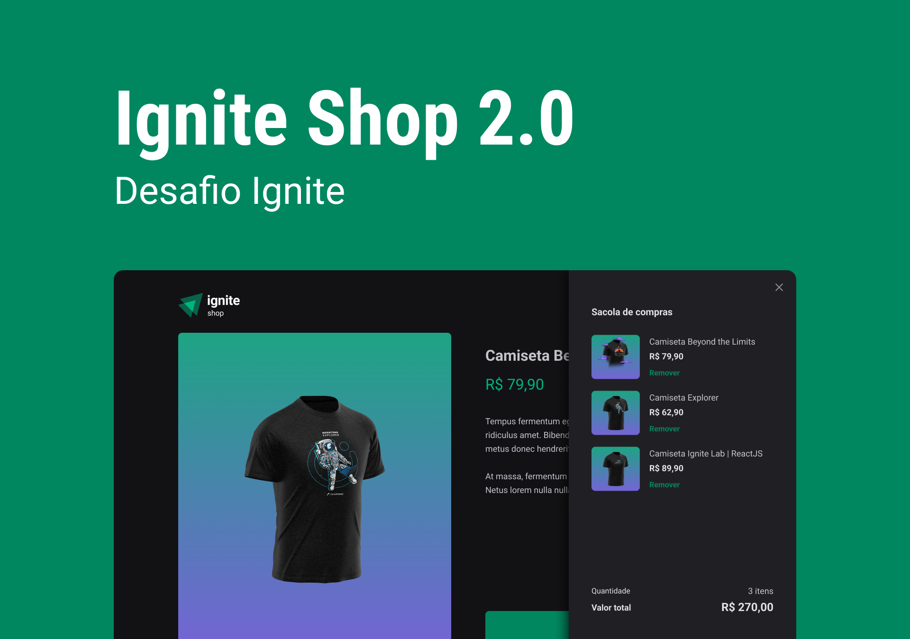

  <h1 align="center">
	  Ignite Shop 🚀
  </h1>
  <!-- <h5 align="left">
	  🚀 Chat app is a messeger app.
  </h5> -->
  <!-- <h5 align="left">
	  As a developer I can never stop learning, I added some new functionallities to take
    the application to the next level, 
    the functionallities are Dark and Light mode of course, 
    I made E2E tests with cypress.
  </h5> -->

  <h2>This application is being built using the following technologies:</h2>
  
  - [ReactJS](https://pt-br.reactjs.org/)
  - [NextJS](https://vitejs.dev/)
  - [TypeScript](https://www.typescriptlang.org/)
  - [React-icons](https://react-icons.github.io/react-icons)
  - [Axios](https://axios-http.com/docs/intro)
  - [Stiches](https://reactrouter.com/)
  - [Stripe API](https://docs.github.com/rest)
  - [Context API](https://reactjs.org/docs/context.html)

<!-- 

  <h2>Features</h2>

    - [x] Register a account
    - [x] Login
    - [x] Send text message
    - [x] Send image
    - [x] Saving data in firestore

 -->

<!-- 

  <h2>Motivation</h2>
    
I created this application to learn firebase.

    - Creating account.
    - Authentication with email and password.
    - Getting data from firestore.
    - Tests E2E with Cypress.

 -->

  <h2>Autor</h2>

 
  
 <b>Flavio Santos</b>

Built with ❤️ by Flavio Santos 👋🏽 get in touch!

